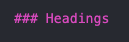
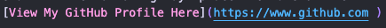
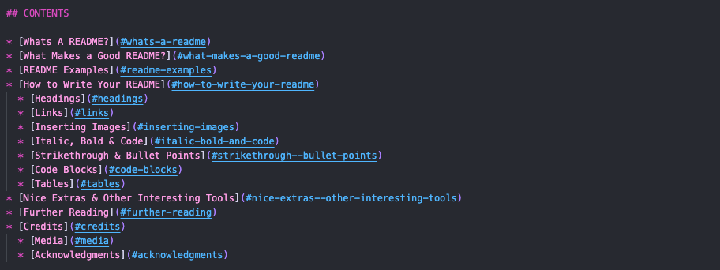
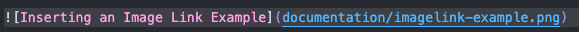
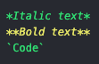
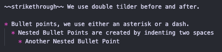
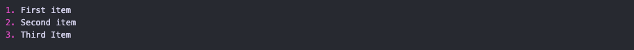
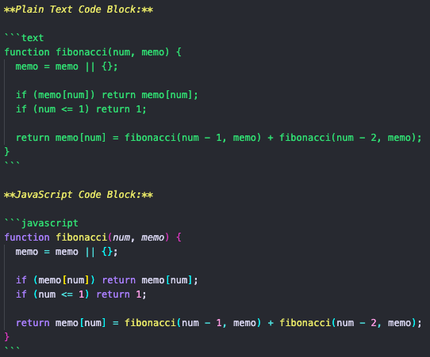
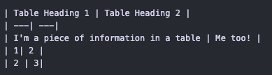
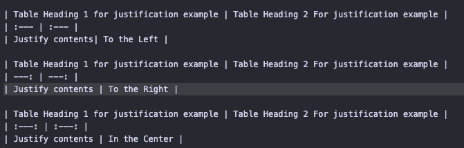

# CREATING YOUR FIRST README


    

So you're starting to think about your first milestone project, and are brainstorming ideas - but have you thought about your README? This repository (and accompanying webinar) are an introduction to creating your first README - covering what to include, why you need one and how to write it.

Find the slide show for this webinar [here](https://docs.google.com/presentation/d/19_7r_To5bu7UjnZD87hrzWQi63Ij0YpaRH1XFnPZZe8/edit?usp=sharing)

- - -

## CONTENTS

* [Whats A README?](#whats-a-readme)
* [What Makes a Good README?](#what-makes-a-good-readme)
* [README Examples](#readme-examples)
* [How to Write Your README](#how-to-write-your-readme)
  * [Headings](#headings)
  * [Links](#links)
  * [Inserting Images](#inserting-images)
  * [Italic, Bold & Code](#italic-bold-and-code)
  * [Strikethrough & Bullet Points](#strikethrough--bullet-points)
  * [Code Blocks](#code-blocks)
  * [Tables](#tables)
* [Nice Extras & Other Interesting Tools](#nice-extras--other-interesting-tools)
* [Further Reading](#further-reading)
* [Credits](#credits)
  * [Media](#media)
  * [Acknowledgments](#acknowledgments)

- - -

## What's a README?

A README file should be the source of all information relating to your project.

It is where another developer (or yourself in a few months time!) can get an overview of your project, like why was this project made, what technology was used, instructions on how to fork or clone the project if they wanted to have a tinker with it, any future implementations planned for the project and if there were any interesting bugs encountered during the build.

- - -

## What makes a Good README?

You can never have enough detail! you've spent a large amount of time perfecting your first project (and each subsequent project will be even more labour intensive and detailed) and the readme is the place to document and celebrate all those hours.

The best piece of advice I was given was to try and complete the bulk of the README before you write a single line of code.

By incorporating this step into the planning stage of your project you will have taken the time to think about what your user stories will be, what colour palette you want to use for your site, what fonts you want to use, how you plan to layout the site responsively and with accessibility in mind and have these documented in your README file before you begin to code your project. The README will then become your roadmap -  it will help you to focus on the project, allow the coding to flow, and prevent you having to complete a whole README at the end of your project when you're suffering from project fatigue!

- - -

## README Examples

I have included examples of a [README.md](milestone1-readme.md) and [TESTING.md](milesstone1-testing.md) for you to look over to get an idea of how you can layout your files and what should be included. I have based this off the README's I have created for my own projects, however I would urge you to make sure that you go through your course criteria for your project to make sure that you include everything required in your own README, as the requirements may change at any point.

- - -

## How to Write Your README

README files are written using markdown, a lightweight plain text syntax.

There are some really cool features in markdown that you might want to include in your README, and I've included some below. I've also included some links to some further reading on markdown.

### Headings

Just like with HTML, markdown has headings. Markdown headings are very similar to HTML headings: there are 6 heading levels, you can only use one level 1 heading per page and ach heading level is smaller than the last.

To create a heading in Markdown you use a hash symbol (#) followed by a space and the heading. The number of hashes denotes the level of the heading - so for a level 1 heading you use 1 hash, a level 2 has 2 hashes etc. The example below shows how you would write a level 3 heading:

  

### Links

Links are also really useful in Markdown, and are really simple to write. There are two ways to include links in your README:  

You can paste a link into your README and it will display as a link, <https://www.github.com/kera-cudmore> - but these can throw a markdown lint error, look a bit messy especially if the link is rather lengthy, and sometimes the URL address doesn't make it clear as to what the link redirects to.

My preferred way to add a link which addresses both these issues is to make a link the following way: place the name of the link that will be visible in the README enclosed in square brackets followed by the link enclosed in parentheses. [View My GitHub Profile Here](https://www.github.com )

  

You can also create a link with headings. When you create a heading, GitHub will generate an ID based on this. This is really useful if you then want to create a link to that heading within your README.  (A good example of this is the contents section.) They are very similar to a link - We need to put the text that will be displayed into the square brackets and then within the parentheses we use a hash followed by the heading - note that we can't use spaces so these need to be changed to a dash)



### Inserting Images

Images can be inserted in your README in the same way as a link, if you only want the name of the image to be displayed.

If you want the image itself to be visible in the README, you just need to place an exclamation mark at the front of the link, example shown below:



Its important to be mindful of what you use in the square brackets of an image link, as this is what will be displayed on the page if the image fails to load, so make sure to use something descriptive, similar to an image alt tag.

When using images in your README, its good practice to compress the image first (PNG format seems to work best), I can recommend [tinyPNG](https://tinypng.com/). I then like to keep all images etc used within the README in a folder called *documentation*. This is good practice as it keeps the sites assets seperate from the assets used in your documentation.

###  Italic, Bold and Code

*Italic text* we can either use an asterisk or an underscore before and after the text.

**Bold text** we can either use double asterisks or double underscores before and after the text.

`Code` we enclose the text in backticks.



### Strikethrough & Bullet Points

~~strikethrough~~ We use double tilder before and after.

* Bullet points, we use either an asterisk or a dash.
  * Nested Bullet Points are created by indenting two spaces
    * Another Nested Bullet Point



To create a numbered list we simply put a number followed by a full stop, then a space before the content.

1. First item
2. Second item
3. Third Item



### Code Blocks

Code blocks can be used in Markdown to display a larger block of code. To create a code block you need to prefix the text with three backticks and end with three backticks after.

Code blocks can be language specific, you simply need to add the language after the first set of backticks - if you don't want to use a specific language, you can use text.

**Plain Text Code Block:**

```text
function fibonacci(num, memo) {
  memo = memo || {};

  if (memo[num]) return memo[num];
  if (num <= 1) return 1;

  return memo[num] = fibonacci(num - 1, memo) + fibonacci(num - 2, memo);
}
```

**JavaScript Code Block:**

```javascript
function fibonacci(num, memo) {
  memo = memo || {};

  if (memo[num]) return memo[num];
  if (num <= 1) return 1;

  return memo[num] = fibonacci(num - 1, memo) + fibonacci(num - 2, memo);
}
```

Code Block Markdown Examples:



### Tables

Tables can be a great way to display information in your README, but can be a bit fiddly to get your head around at first. Tables are created using the pipe symbol ( | ) which is placed on either side of the content, creating the sides of the table. The first row of the table will be the headings for the table. This is then followed by a row with 3 dashes in each cell, and then you just add the contents for the table in the following rows.

| Table Heading 1 | Table Heading 2 |
| --- | --- |
| I'm a piece of information in a table | Me too! |
| 1| 2 |
| 2 | 3|

Markdown for creating a table:



You can also justify the contents within a table! You simply need to add a colon to the second row of dashes - place the colon on the left of the dashes for left justification, to the right of the dashes for right justification and to center the text, place a colon on each side of the dashes.

| Table Heading 1 for justification example | Table Heading 2 For justification example |
| :--- | :--- |
| Justify contents| To the Left |

| Table Heading 1 for justification example | Table Heading 2 For justification example |
| ---: | ---: |
| Justify contents | To the Right |

| Table Heading 1 for justification example | Table Heading 2 For justification example |
| :---: | :---: |
| Justify contents | In the Center |


 - - -

## Nice Extras & Other Interesting Tools

Nice extras we could include in the README:

[shields.io Badges](https://shields.io/) -  lots of badges relating to site builds. I like to add these after the site image at the top of my README. I like to include the following badges in my projects, but have an explore and see if there are any others you could use (they are also great to include in your GitHub Profile!)

* GitHub last commit (Shows when the last commit to the repo was)
* GitHub contributors (Great to show at a glance you are the only contributor to your project)
* GitHub language count (Shows how many languages used in project)
* GitHub top language (to display top language used in the project)
* W3C validation (shows at a glance whether your HTML passes validation)


[Gyazo GIF](https://gyazo.com) - A tool that allows you to capture a short video recording of your screen as a GIF. I like to use this to document a bug I might have (For example in my second project, each time a button was pressed the score would increase when it shouldn't have - this was a great way to capture what was happening). Have a look, or perhaps you have your own preferred screen recording tool you prefer.

[Chrome Extension Spell Checker](https://chrome.google.com/webstore/detail/webpage-spell-check/mgdhaoimpabdhmacaclbbjddhngchjik) I love to use this both on my site and to check over my README before submission, as its easy to get spelling errors creeping into your project as you burn the midnight oil towards the end as your deadline is looming.

[Chrome Exension WAVE](https://chrome.google.com/webstore/detail/wave-evaluation-tool/jbbplnpkjmmeebjpijfedlgcdilocofh) WAVE is a web accessibility evaluation tool developed by [WebAIM.org](https://wave.webaim.org/). It provides visual feedback about the accessibility of your web content by injecting icons and indicators into your page. No automated tool can tell you if your page is accessible, but WAVE facilitates human evaluation and educates about accessibility issues. All analysis is done entirely within the Chrome browser allowing secure valuation of intranet, local, password protected, and other sensitive web pages. I believe there is also an extension for Firefox.

[Web Disability Simulator](https://chrome.google.com/webstore/detail/web-disability-simulator/olioanlbgbpmdlgjnnampnnlohigkjla) A fantastic chrome extension that allows you to simulate how certain disabilities can affect the users experience of your site. Really useful if you're using colour to represent a result - for example in a quiz.

- - -

## Further Reading

* [Markdown Syntax](https://www.markdownguide.org/basic-syntax/) - This site is really comprehensive on all the different things you can do in Markdown.
* [Markdown Table Generator](https://www.tablesgenerator.com/markdown_tables) - This may be useful to have a play around with to better understand how tables work in Markdown.
* [Markdown Cheatsheet](https://github.com/atapas/markdown-cheatsheet) - A great markdown cheatsheet created by Atapas.
* [Code Institute Sample README](https://github.com/Code-Institute-Solutions/SampleREADME) - Sample README created by the Code Institute

## Credits

### Media

• All screenshots of code used in this README were taken by myself from my own milestone project repositories or Code Institute hackathon projects I have participated in.

• [README hero image](https://www.slidescarnival.com/aliena-free-presentation-template/4597) - Slide template from Slide Carnival

### Acknowledgments

* [Ed](https://github.com/Edb83) - For letting me know about the heading links feature.
* [Dave](https://github.com/daveyjh) - For letting me know about table justification in markdown.
* Nerd Alert - For cheering me on while creating this webinar, and for proof-reading my documents.
* A big thank you to Jim at Code Institute for the opportunity to be a channel lead for the Milestone 1 slack channel.
