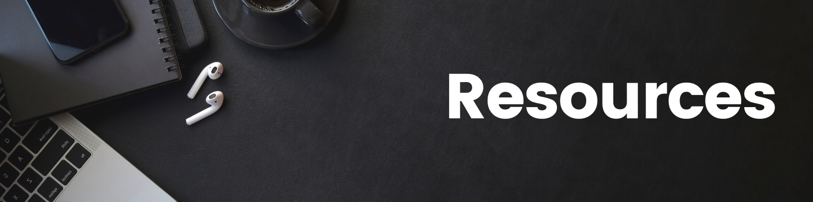

A list of resources that may be useful when completing your README.

# Contents

* [Royalty Free Resources](#royalty-free-resources)
  * [Animations](#animations)
  * [Audio](#audio)
  * [Backgrounds](#backgrounds)
  * [Icons](#icons)
  * [Illustrations](#illustrations)
  * [Photos](#photos)
  * [Video](#video)
* [Design Resources](#design-resources)
  * [Colour Palettes](#colour-palettes)
  * [Typography](#typography)
  * [Wireframes](#wireframes)
  * [Flowcharts, Diagrams & ERD's](#flowcharts-diagrams--erds)
* [Testing Resources](#testing-resources)
  * [HTML & CSS](#html--css)
  * [JavaScript](#javascript)
  * [Python](#python)
  * [Lighthouse](#lighthouse)
  * [Accessibility](#accessibility)
* [Other Useful Tools](#other-useful-tools)
  * [Badges](#badges)
  * [File Conversion & Compression](#file-conversion--compression)
  * [Responsive Site Viewers](#responsive-site-viewers)

---

## Royalty Free Resources

### **Animations**

|  | Link | Description |
| :---: |:--- | :--- |
| 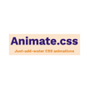 | [Animate.css](https://animate.style/) |Animate.css is a library of ready-to-use, cross-browser animations for you to use in your projects. |
|  | [Animejs](https://animejs.com/) | A lightweight JavaScript animation library with a simple, yet powerful API. |
| 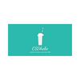 | [CSS Shake](https://elrumordelaluz.github.io/csshake/) | Some CSS classes to move your DOM! |
| 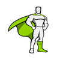 | [Greensock](https://greensock.com/gsap/) | JavaScript animation built for professionals, GSAP is packed with features that make most other engines look like cheap toys. |
|  | [Loading.io](https://loading.io/) | Build Your Ajax Loading Icons, Animated Text and More with SVG / CSS / GIF / PNG ! |
| 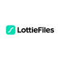 | [Lottie Files](https://lottiefiles.com/?gclid=CjwKCAjww8mWBhABEiwAl6-2RS3WVMkAMbDT84_nKST9znN2UuMJ7vyJVKMAvlN3IuC44dIeSzVQGBoCW9YQAvD_BwE) | Lightweight, scalable animations for your website and apps. |
| 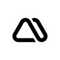 | [Magic Animations CSS](https://www.minimamente.com/project/magic/) | Magic CSS are a set of simple animations to include in your web or app project's. |
|  | [Moving Letters](https://tobiasahlin.com/moving-letters/) |  Letter animation code. |
| 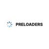 | [Preloaders.net](https://icons8.com/preloaders/) | provides more than 1000 different animations, split into 18 categories including most widely used loading spinners, horizontal bars and more. |
| 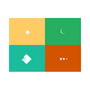 | [Spinkit](https://tobiasahlin.com/spinkit/) | Simple CSS Spinners. |
| 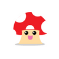 | [Wicked CSS](http://kristofferandreasen.github.io/wickedCSS/) | For the ones looking to spice up their sites with some sweet animation effects. |

### **Audio**

|  | Link | Description |
| :---: |:--- | :--- |
|  | [Audio Micro](https://www.audiomicro.com/free-sound-effects/) | Royalty Free stock music for any project. |
| 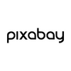 | [Pixabay](https://pixabay.com) | Pixabay is a vibrant community of creatives, sharing copyright free images, videos and music. |
|  | [Videvo](https://www.videvo.net/) | Royalty Free Music. Thousands of royalty-free stock music tracks at your fingertips. |
|  | [Zapsplat](https://www.zapsplat.com/) | Over 111,000 free sound effects & more than 450 royalty free music tracks. |

### **Backgrounds**

|  | Link | Description |
| :---: |:--- | :--- |
| 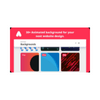 | [Animatedbackgrounds.me](https://animatedbackgrounds.me/#mm) | A Collection of 30+ animated backgrounds for websites and blogs. |
|  | [BG Jar](https://bgjar.com/) | Free svg background generator for your websites, blogs and app. |
| 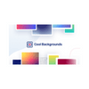 | [Cool Backgrounds](https://coolbackgrounds.io/) | A collection of tools to create compelling, colorful images for blogs, social media, and websites.  |
| 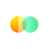 | [CSS Gradient](https://cssgradient.io/) | A free css gradient generator tool, this website lets you create a colorful gradient background for your website, blog, or social media profile. |
| 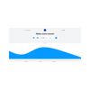 | [Get Waves](https://getwaves.io/) | A free SVG wave generator to make unique SVG waves for your next web design. Choose a curve, adjust complexity, randomize! |
|  | [Particles.js](https://marcbruederlin.github.io/particles.js/) | particles.js is a lightweight JavaScript library for creating particles. |
| 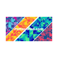 | [Pattern Pad](https://patternpad.com/) | PatternPad generates graphical patterns based on a variety of parameters. This results in an endless number of variations. |
| 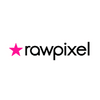 | [RawPixel](https://www.rawpixel.com/) | Free images, PNGs, stickers, backgrounds, wallpapers, graphic templates and PSD mockups. |
| 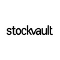 | [Stock Vault](https://www.stockvault.net/) | 139,637 free stock photos, textures, backgrounds and graphics for your next project. |
| 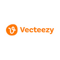 | [Vecteezy](https://www.vecteezy.com/?utm_source=google&utm_medium=cpa&utm_campaign=search&utm_term=freevectors&utm_content=a&gclid=CjwKCAjww8mWBhABEiwAl6-2RXu9c03gxX7SY7212DASIrPCgad0Xr_tQHkyVg7KACQy8GfrMp49ihoC3_gQAvD_BwE) | Explore royalty-free vectors, clipart graphics, icons, stock photos, stock videos, backgrounds, patterns, banners, and designs. |

### **Icons**

|  | Link | Description |
| :---: |:--- | :--- |
| 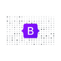 | [Bootstrap Icons](https://icons.getbootstrap.com/) | Free, high quality, open source icon library with over 1,600 icons. |
|  | [Font Awesome](https://fontawesome.com/) | Font Awesome is the Internet's icon library and toolkit, used by millions of designers, developers, and content creators. |
|  | [Noun Project](https://thenounproject.com/) | Noun Project features the most diverse collection of icons and stock photos ever. Download SVG and PNG. Browse over 5 million art-quality icons and photos. |
| 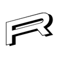 | [Reshot](https://www.reshot.com/) | Design freely with instant downloads of curated SVG icons and vector illustrations. All free with commercial licensing. |
| 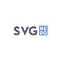 | [SVG Repo](https://www.svgrepo.com/) | Free Vectors and Icons in SVG format. Download free mono or multi color vectors for commercial use. Search in 300.000+ Free SVG Vectors and Icons. |
|  | [Vecteezy](https://www.vecteezy.com/?utm_source=google&utm_medium=cpa&utm_campaign=search&utm_term=freevectors&utm_content=a&gclid=CjwKCAjww8mWBhABEiwAl6-2RXu9c03gxX7SY7212DASIrPCgad0Xr_tQHkyVg7KACQy8GfrMp49ihoC3_gQAvD_BwE) | Explore royalty-free vectors, clipart graphics, icons, stock photos, stock videos, backgrounds, patterns, banners, and designs. |

### **Illustrations**

|  | Link | Description |
| :---: |:--- | :--- |
| 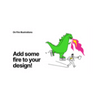 | [On Fire Illustrations](https://onfire.craftwork.design/) | Free illustrations that will wake any project up with its unique mood. |
| 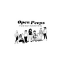 | [Open Peeps](https://www.openpeeps.com/) | Open Peeps is a hand-drawn illustration library to create scenes of people.  |
|  | [Reshot](https://www.reshot.com/) | Design freely with instant downloads of curated SVG icons and vector illustrations. All free with commercial licensing |
|  | [Stock Vault](https://www.stockvault.net/) | 139.637 free stock photos, textures, backgrounds and graphics for your next project. |

### **Photos**

|  | Link | Description |
| :---: |:--- | :--- |
|  | [FreePik](https://www.freepik.com/)| All the assets you need, in one place. Find and download the best high-quality photos, designs and mockups. |
|  | [Noun Project](https://thenounproject.com/) | Noun Project features the most diverse collection of icons and stock photos ever. Download SVG and PNG. Browse over 5 million art-quality icons and photos. |
| 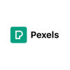 | [Pexels](https://www.pexels.com) | Free stock photos & videos you can use everywhere. Browse millions of high-quality royalty free stock images & copyright free pictures. |
| 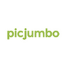 | [PicJumbo](https://picjumbo.com/) | Picjumbo is a free stock photo site created in 2013 by designer & photographer Viktor Hanacek. |
| 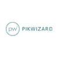 | [PikWizard](https://pikwizard.com/) | Free images, videos & free stock photos. Unlimited downloads ✓ Royalty-free Images ✓Copyright-free for commercial use. |
|  | [Pixabay](https://pixabay.com) | Pixabay is a vibrant community of creatives, sharing copyright free images, videos and music. |
|  | [Pxhere](https://pxhere.com) | Over 1,147,466 high quality photos. Free for commercial use. |
|  | [RawPixel](https://www.rawpixel.com/) | Free images, PNGs, stickers, backgrounds, wallpapers, graphic templates and PSD mockups. |
|  | [Reshot](https://www.reshot.com/) | Design freely with instant downloads of curated SVG icons and vector illustrations. All free with commercial licensing. |
|  | [Stock Vault](https://www.stockvault.net/) | 139,637 free stock photos, textures, backgrounds and graphics for your next project. |
| 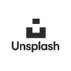 | [Unsplash](https://unsplash.com) | Beautiful, free images and photos that you can download and use for any project. |
|  | [Vecteezy](https://www.vecteezy.com/?utm_source=google&utm_medium=cpa&utm_campaign=search&utm_term=freevectors&utm_content=a&gclid=CjwKCAjww8mWBhABEiwAl6-2RXu9c03gxX7SY7212DASIrPCgad0Xr_tQHkyVg7KACQy8GfrMp49ihoC3_gQAvD_BwE) | Explore royalty-free vectors, clipart graphics, icons, stock photos, stock videos, backgrounds, patterns, banners, and designs. |

### **Video**

|  | Link | Description |
| :---: |:--- | :--- |
|  | [Pexels](https://www.pexels.com) | Free stock photos & videos you can use everywhere. Browse millions of high-quality royalty free stock images & copyright free pictures. |
|  | [Pixabay](https://pixabay.com) | Pixabay is a vibrant community of creatives, sharing copyright free images, videos and music. |
|  | [Vecteezy](https://www.vecteezy.com/?utm_source=google&utm_medium=cpa&utm_campaign=search&utm_term=freevectors&utm_content=a&gclid=CjwKCAjww8mWBhABEiwAl6-2RXu9c03gxX7SY7212DASIrPCgad0Xr_tQHkyVg7KACQy8GfrMp49ihoC3_gQAvD_BwE) | Explore royalty-free vectors, clipart graphics, icons, stock photos, stock videos, backgrounds, patterns, banners, and designs. |
|  | [Videvo](https://www.videvo.net/) | Over 300,000 video clips in 4K and HD |

---

## Design Resources

### **Colour Palettes**

|  | Link | Description |
| :---: |:--- | :--- |
| 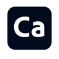 | [Adobe Capture](https://www.adobe.com/uk/products/capture.html) | 📱 MOBILE APP - Use your mobile device as a vector converter to turn photos into colour themes, patterns, type, materials, brushes and shapes. |
| 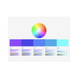 | [Adobe Color Wheel](https://color.adobe.com/create/color-wheel) | Create color palettes with the color wheel or image, browse thousands of color combinations from the Adobe Color community. |
| 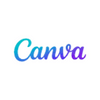 | [Canva](https://www.canva.com/colors/color-palette-generator/) | Want a color scheme that perfectly matches your favorite images? With Canva's color palette generator, you can create color combinations in seconds. |
| 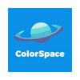 | [ColorSpace](https://mycolor.space/?hex=%23F5F5F5&sub=1) | Here you can find the perfect matching color scheme for your next project! Generate nice color palettes, color gradients and much more! |
| 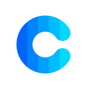 | [Coolors](https://coolors.co/) | Generate or browse beautiful color combinations for your designs. |
| 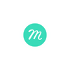 | [Muzli Colors](https://colors.muz.li/) | Search, discover, test and create beautiful color palettes for your projects. |

### **Typography**

|  | Link | Description |
| :---: |:--- | :--- |
|  | [Font Joy](https://fontjoy.com/) | Fontjoy helps designers choose the best font combinations. Mix and match different fonts for the perfect pairing. |
|  | [Google Fonts](https://fonts.google.com/) | Google Fonts is a library of 1,453 open source font families and APIs for convenient use via CSS and Android. |
| 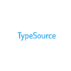 | [TypeSource](https://tobiasahlin.com/typesource/) | Google Web Font inspiration in HTML & CSS |

### **Wireframes**

|  | Link | Description |
| :---: |:--- | :--- |
| 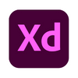 | [AdobeXD](https://www.adobe.com/products/xd.html) | 💰 Subscriprion needed - Adobe XD is a vector design tool for web and mobile applications, developed and published by Adobe Inc. It is available for macOS and Windows, and there are versions for iOS and Android to help preview the result of work directly on mobile devices. |
|  | [Balsamiq](https://balsamiq.com/) | 💰 Subscriprion needed - Wireframe tool. 💡 Tip: Code Institute students have access to balsamiq (2022). See slack for more details. |
|  | [Figma](https://www.figma.com/) | Figma is a collaborative web application for interface design, with additional offline features enabled by desktop applications for macOS and Windows. |
|  | [Mockup](https://apps.apple.com/us/app/mockup-sketch-ui-ux/id1527554407) | 📱 Mobile App -  Sketch your next project. |
|  | [Sketch](https://www.sketch.com/?utm_source=google&utm_medium=cpc&adgroup=uxui&device=c&matchtype=e&utm_campaign=ADDICTMOBILE_SKETCH_GAD_DG_UK_T1_ALWAYS-ON_S_TRF_PROS_BRAND&utm_term=sketch&utm_source=google&utm_medium=cpc&utm_content=TOF_BRND__generic&hsa_acc=8710913982&hsa_cam=16831089317&hsa_grp=134620695759&hsa_ad=592060065319&hsa_src=g&hsa_tgt=kwd-14921750&hsa_kw=sketch&hsa_mt=e&hsa_net=adwords&hsa_ver=3&gclid=Cj0KCQjwr4eYBhDrARIsANPywCjRIFn93DMezYnsyE5Fic_8l8kynJtut0GYMU01TiohHjwziFtlH0gaAhteEALw_wcB) | 💰 Subscriprion needed - Sketch gives you all the tools you need for a truly collaborative design process. From early ideas to pixel-perfect artwork, playable prototypes and developer handoff. |

### **Flowcharts, Diagrams & ERD's**

|  | Link | Description |
| :---: |:--- | :--- |
| 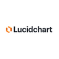 | [Lucidchart](lucidchart.com/pages/landing?utm_source=google&utm_medium=cpc&utm_campaign=_chart_en_tier1_mixed_search_brand_exact_&km_CPC_CampaignId=1490375427&km_CPC_AdGroupID=55688909257&km_CPC_Keyword=lucidchart&km_CPC_MatchType=e&km_CPC_ExtensionID=&km_CPC_Network=g&km_CPC_AdPosition=&km_CPC_Creative=442433236001&km_CPC_TargetID=kwd-33511936169&km_CPC_Country=9045329&km_CPC_Device=c&km_CPC_placement=&km_CPC_target=&gclid=CjwKCAjwhNWZBhB_EiwAPzlhNk4UE5S6D47XQSncwqACfXUNmr7auFvJ3DXvt3XMqAX5cKDfew63kBoCF6YQAvD_BwE) | Create flowcharts & diagrams online |
|  | [Diagrams.net](https://app.diagrams.net/) | Free online diagram software. |
|  | [Wireflow](https://wireflow.co/) |A  free, online and open source tool for creating beautiful user flow prototypes. |

---

## Testing Resources

### **HTML & CSS**

|  | Link | Description |
| :---: |:--- | :--- |
|  | [Free Formatter](https://www.freeformatter.com/html-validator.html) | Free online tools for developers, including formatters (JSON, XML, HTML, SQL, etc.), minifiers (JavaScript, CSS), validators, compactors and many more! |
| 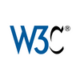 | [W3C Validator](https://validator.w3.org/) | This validator checks the markup validity of Web documents in HTML, XHTML, SMIL, MathML, etc. It can also validate your CSS. |

### **JavaScript**

|  | Link | Description |
| :---: |:--- | :--- |
|  | [JS Hint](https://jshint.com) | This is online PEP8 checker. Just paste your code or upload file and see results. |

### **Python**

|  | Link | Description |
| :---: |:--- | :--- |
| ⛔️ Currently Down | [PEP8Online](http://pep8online.com/) | This is online PEP8 checker. Just paste your code or upload file and see results. |

### **Lighthouse**

|  | Link | Description |
| :---: |:--- | :--- |
|  | [Lighthouse Overview](https://developer.chrome.com/docs/lighthouse/overview/) | Chrome DevTools is a set of web developer tools built directly into the Google Chrome browser. |

### **Accessibility**

|  | Link | Description |
| :---: |:--- | :--- |
| 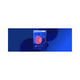 | [Colour Contrast Checker](https://www.siteimprove.com/toolkit/color-contrast-checker/) | This tool tests the contrast ratio of your background and text for accessibility. It will also indicate if the colors pass the WCAG contrast ratio. |
| 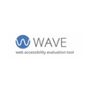 | [WAVE Website](https://wave.webaim.org/) | WAVE® is a suite of evaluation tools that helps authors make their web content more accessible to individuals with disabilities. WAVE can identify many accessibility and Web Content Accessibility Guideline (WCAG) errors, but also facilitates human evaluation of web content. |
|  | [WAVE Website](https://wave.webaim.org/) | [Wave Chrome Extension](https://chrome.google.com/webstore/detail/wave-evaluation-tool/jbbplnpkjmmeebjpijfedlgcdilocofh) | 🧩 Chrome Extension - WAVE for use directly in the browser. |

---

## Other Useful Tools

### **Badges**

|  | Link | Description |
| :---: |:--- | :--- |
|  | [Shields.io](https://shields.io/) | fast and scalable informational images as badges for GitHub, Travis CI, Jenkins, WordPress and many more. |
|  | [Badgen](https://badgen.net/) | Fast handcraft svg badge generator. |

### **File Conversion & Compression**

|  | Link | Description |
| :---: |:--- | :--- |
| 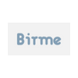 | [Birme](https://www.birme.net/) | Image resizer, cropper and format converter. |
| 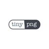 | [TinyPNG]() | Reduce the file size of your WEBP, JPEG and PNG files. |
|  | [Cloud Convert](https://cloudconvert.com/) | Online file converter. |
|  | [Online Convert](https://www.online-convert.com/) | Free online file converter. |

### **Responsive Site Viewers**

|  | Link | Description |
| :---: |:--- | :--- |
| 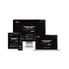 | [Am I Responsive](https://ui.dev/amiresponsive) | Show off how responsive design looks across different browsers easily with this 4 in 1 viewport tool. See how your site looks on desktop, laptop, tablet & mobile. 💡 Tip: You can showcase different pages on each of the devices, simply use your navigation within the device to navigate to the page you want to display.|
|  | [Multi Device Mockup Generator](https://techsini.com/multi-mockup/index.php) | Multi device website mockup generator is free online tool to test your responsive website on apple devices including Apple iMac, Macbook, iPad and iPhone. |
|  | [Media Genesis](https://responsivedesignchecker.com/medi) | Responsive web design checker. |
| | [BrowserStack](https://www.browserstack.com/) | Responsive design testing on real devices. |
